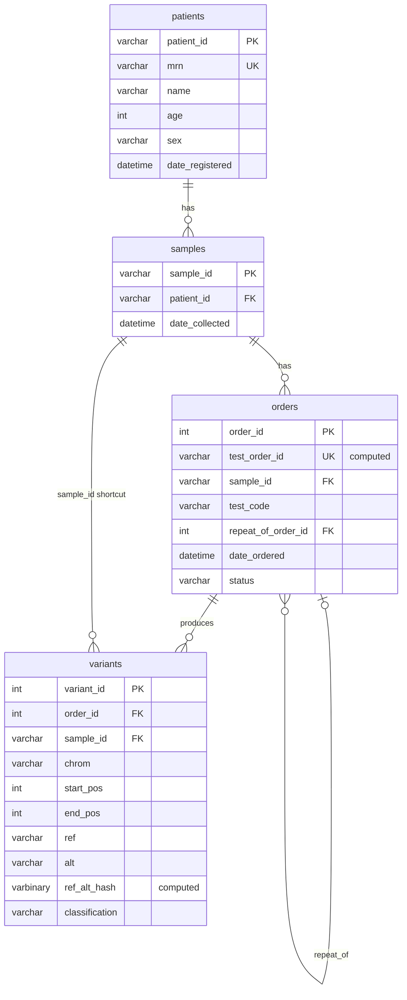

# Database Schema

`db/schema.sql` is a reference snapshot: what a brand-new database should
look like today. It is not run against a live database directly — `CREATE
TABLE` fails outright if the table already exists, so it only works once,
against something empty. The actual source of truth for changes over time is
`db/migrations/`: small, numbered, one-way SQL files. `_scripts/run_migrations.py
[test|prod]` applies whatever hasn't run yet on that instance and skips what
has — it creates and manages a `migration_history` table automatically
(tracked by filename, e.g. `0001_init.sql`), so migration files themselves
don't need to self-track. To change the schema (add a table, add a column,
whatever), add a new file in `db/migrations/` — copy the pattern in
`0002_example_add_column.sql.txt` — never edit `0001_init.sql` or any
already-applied migration after the fact. Periodically regenerate
`schema.sql` from the current state of `migrations/` so the snapshot doesn't
go stale, but treat that regeneration as documentation, not something you
run.

CI (`.github/workflows/deploy.yml`) runs `run_migrations.py prod` on every
push to `main`. Before relying on this: confirm `DatabaseManager`'s
connection either sets `autocommit=True` or that `get_cursor()` explicitly
commits on a clean exit — `run_migrations.py` never calls `conn.commit()`
itself, so if neither of those is true, migrations will report success
without actually persisting.

Engine: Azure SQL Server (confirmed via the connection in use —
`iteragen.database.windows.net`, database `genomics_test`). Note:
`nw.md` was originally drafted assuming Azure PostgreSQL; that's a mismatch
worth resolving so networking docs match the actual engine.

Test and production are two separate Azure SQL Database instances, not one
shared database with a credential switch — `schema.sql` is applied
identically to both (see the note at the top of that file), and
`DatabaseManager` picks which instance to connect to based on environment
(`.env.test` / `.env.prod`). This holds regardless of whether the prod
instance is actually provisioned yet. Keeping the two identical is a process
requirement, not something enforced by the SQL itself: always apply
`schema.sql` to both instances the same way (e.g. via a small deploy script
parameterized by environment) rather than hand-editing either one directly.

The frontend currently talks to the database directly through
`DatabaseManager`, with no API layer in between. An API layer is planned —
not yet built — for when this needs to serve more than the one Streamlit
app.

`DatabaseManager`'s password lookup prefers Azure Key Vault over a plain
`.env` value: if `KEY_VAULT_NAME` is set, it fetches `db-password-test` or
`db-password-prod` (matching `env`) from that vault via
`DefaultAzureCredential`, rather than reading `DB_PASSWORD` from
`.env.<env>` directly. The `.env` value still works as a fallback when
`KEY_VAULT_NAME` isn't set, so this doesn't break local setups that haven't
migrated yet — but Key Vault is the intended path once this is more than a
local prototype, since it means the real password never sits in a plaintext
file on disk.

## Entity relationship

The chain runs MRN to patient, `patient_id` to samples, and `sample_id` to
orders and variants. `patients` has no `sample_id` on purpose: one MRN can
have many samples over time (different draws), so a single `sample_id` on the
patient row could only hold one of them.

- One patient (by `mrn`) can have many samples (different draws over time).
- One sample can have many orders (different test codes, or the same
  test code repeated on the same extracted DNA/RNA).
- One order can have many variant calls.
- An order can optionally point back at the order it's repeating
  (`repeat_of_order_id`), e.g. when a sequencing run fails and the same
  test is re-ordered against the same sample.

Two links worth knowing about:

- `variants` has two parents. It links to `orders` through `order_id` and to
  `samples` through the `sample_id` shortcut. The pipeline uploader has to
  copy `sample_id` from the parent order when it inserts variants, so the two
  always match.
- `orders` links to itself through `repeat_of_order_id`, which points back at
  the order being repeated.

## `patients`

| Column | Type | Notes |
|---|---|---|
| `patient_id` | `VARCHAR(20)` PK | App-generated, format `YYYYMMDD-00001` (date + daily serial). Not a DB identity — the application must generate this before insert. |
| `mrn` | `VARCHAR(50)` NOT NULL UNIQUE | Medical record number, the human-facing identifier used in the frontend search. |
| `name` | `VARCHAR(100)` NOT NULL | |
| `age` | `INT` NOT NULL | |
| `sex` | `VARCHAR(10)` NOT NULL | |
| `date_registered` | `DATETIME` DEFAULT `GETDATE()` | |

**Why `patient_id` isn't an `IDENTITY` column:** an earlier version tried to
compute `patient_id` from `YEAR(GETDATE())`, which SQL Server rejects as a
key column because `GETDATE()` is non-deterministic. Generating the ID in
application code (see `generate_next_patient_id()` in `frontend/app.py`)
sidesteps that, at the cost of the app owning uniqueness — see the race
condition note under "Known limitations" below.

## `samples`

| Column | Type | Notes |
|---|---|---|
| `sample_id` | `VARCHAR(40)` PK | App-generated, format `SAM-YYYYMMDD-00001`. |
| `patient_id` | `VARCHAR(20)` NOT NULL FK → `patients.patient_id` | |
| `date_collected` | `DATETIME` DEFAULT `GETDATE()` | |

Index: `idx_samples_patient_id` on `patient_id` (SQL Server doesn't
auto-index foreign keys, only primary keys — every FK column in this schema
has an explicit index for join performance).

## `orders`

| Column | Type | Notes |
|---|---|---|
| `order_id` | `INT IDENTITY(1,1)` PK | DB-generated, guarantees uniqueness with no app-side locking. |
| `test_order_id` | computed, `PERSISTED UNIQUE` | `'ORD-' + order_id`. Friendly display ID. **Cannot be inserted into directly** — read it back with `OUTPUT INSERTED.test_order_id` after an insert. |
| `sample_id` | `VARCHAR(40)` NOT NULL FK → `samples.sample_id` | |
| `test_code` | `VARCHAR(50)` NOT NULL | e.g. `Hereditary_Cancer`, `Cardio_Risk`, `Whole_Exome`. Currently free text in the frontend dropdown — not DB-constrained to a fixed list. |
| `repeat_of_order_id` | `INT` NULL FK → `orders.order_id` (self) | Set when this order repeats a prior one on the same sample (e.g. failed sequencing run, re-run on the same extracted material). NULL for a first attempt. |
| `date_ordered` | `DATETIME` DEFAULT `GETDATE()` | |
| `status` | `VARCHAR(20)` DEFAULT `'Pending'`, `CHECK IN ('Pending','Running','Completed','Failed','Cancelled','Deleted')` | `Deleted` was added by migration `0002_add_deleted_status.sql` and is what the soft-delete action sets. |

Indexes: `idx_orders_sample_id`, `idx_orders_repeat_of`.

**Why there's no "run number" column:** an earlier design tried to encode a
run/attempt number into `test_order_id` (e.g. `...-R2`), which required
locking (`UPDLOCK, HOLDLOCK`) to safely compute "next run" under concurrent
orders. Using a plain `IDENTITY` column removes the need for that locking
entirely — SQL Server guarantees uniqueness for free. "Which attempt this
is" is now a display/traceability concern (`repeat_of_order_id` +
`date_ordered`), not a schema-enforced sequence.

## `variants`

| Column | Type | Notes |
|---|---|---|
| `variant_id` | `INT IDENTITY(1,1)` PK | |
| `order_id` | `INT` NOT NULL FK → `orders.order_id` | |
| `sample_id` | `VARCHAR(40)` NOT NULL FK → `samples.sample_id` | Denormalized for query convenience (avoids a join through `orders` for simple sample-level lookups). **Must be kept in sync with the parent order's `sample_id` by the pipeline uploader at insert time** — SQL Server can't cross-check this against a second table automatically. |
| `chrom` | `VARCHAR(5)` NOT NULL | |
| `start_pos` | `INT` NOT NULL | |
| `end_pos` | `INT` NOT NULL | |
| `ref` | `VARCHAR(MAX)` NOT NULL | |
| `alt` | `VARCHAR(MAX)` NOT NULL | |
| `ref_alt_hash` | computed, `PERSISTED`, `VARBINARY(32)` | `HASHBYTES('SHA2_256', ref + '|' + alt)`. Stands in for `(ref, alt)` in the uniqueness constraint below, since SQL Server won't allow a `MAX`-length column as an index/constraint key. |
| `classification` | `VARCHAR(50)` NOT NULL, `CHECK IN ('Pathogenic','Likely Pathogenic','VUS','Likely Benign','Benign')` | Standard ACMG five-tier classification. |

Constraint: `uq_variants_call UNIQUE (order_id, chrom, start_pos, ref_alt_hash)`
— prevents the pipeline uploader from inserting the same variant call twice
on a retry.

Indexes: `idx_variants_sample_id`, `idx_variants_order_id`.

## Deletes

There is no `ON DELETE CASCADE` anywhere in this schema. Deleting a patient,
sample, or order is blocked by default (SQL Server's `NO ACTION`) rather
than silently cascading through samples → orders → variants. Clinical
genomic data typically carries retention requirements (CLIA/CAP and
state-level rules commonly require multi-year retention), so an accidental
delete should fail loudly, not quietly wipe downstream records. If records
genuinely need to be retired, use a soft-delete flag (e.g. `is_active`)
rather than a hard delete — not yet implemented.

Schema changes follow a stricter rule than this: migrations never drop a
table or column and never insert, update or delete rows. Retired columns and
tables are renamed with an `_archive` suffix instead. The full policy is in
`db/migrations/README.md`.

## Known limitations / open items

- **`patient_id` and `sample_id` generation is not race-safe.** Both are
  computed in application code via `SELECT COUNT(*) ... WHERE ... LIKE
  'prefix%'`, which can return the same "next number" to two concurrent
  requests. This hasn't caused a problem yet at low usage, but should be
  fixed (transaction + `UPDLOCK, HOLDLOCK`, or switch to a DB sequence)
  before multi-user concurrent use.
- **`test_code` is not constrained to a fixed set at the DB level** — only
  by the frontend's dropdown. A future migration should probably add a
  lookup table or `CHECK` constraint once the panel list stabilizes.
- **Order deletion is a soft-delete only** (`status = 'Deleted'` via the
  frontend's delete button, not a hard `DELETE`). Undo, an audit trail of
  who deleted what and when, and a confirmation modal before deleting are
  intentionally out of scope for this demo — a production version would
  need at least an audit log (who/when/previous status) before this
  feature touches real patient data.

## Reset script

`db/reset_dev_db.sql` drops all four tables and is dev/test only — never run
against production. Re-run `schema.sql` afterward to recreate an empty
schema.